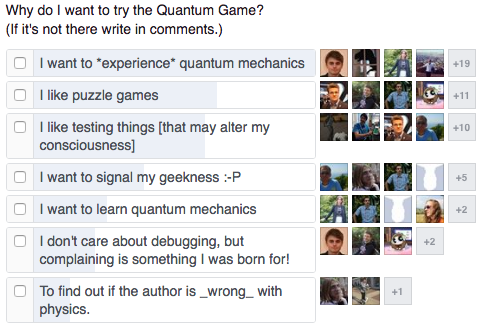

Moreover, the sandbox mode ([Virtual Lab by Quantum Flytrap](https://lab.quantumflytrap.com)) allows playing with quantum physics, replicating famous experiments (real and gedanken), creating new levels, designing quantum decorations, and simply having fun.

It is possible to create quantum computing algorithms ([Deutsch-Jozsa](https://lab.quantumflytrap.com/lab/deutsch-jozsa)), quantum cryptography protocols ([BB84](https://lab.quantumflytrap.com/lab/bb84) and [Ekert](https://lab.quantumflytrap.com/lab/ekert-bell)), advanced quantum measurements ([Elitzur–Vaidman bomb tester](https://lab.quantumflytrap.com/lab/elitzur%E2%80%93vaidman-bomb) and [nonorthogonal state discrimination](https://lab.quantumflytrap.com/lab/nonorthogonal-state-discrimination)), historical interferometers ([Mach-Zehnder](https://lab.quantumflytrap.com/lab/mach-zehnder) and [Michaelson-Morley](https://lab.quantumflytrap.com/lab/michelson-morley)), classical optics ([three polarizers](https://lab.quantumflytrap.com/lab/three-polarizer-paradox) and [an optical diode](https://lab.quantumflytrap.com/lab/optical-diode)), and much more: [here are some user-created ones](https://lab.quantumflytrap.com/u/)!
